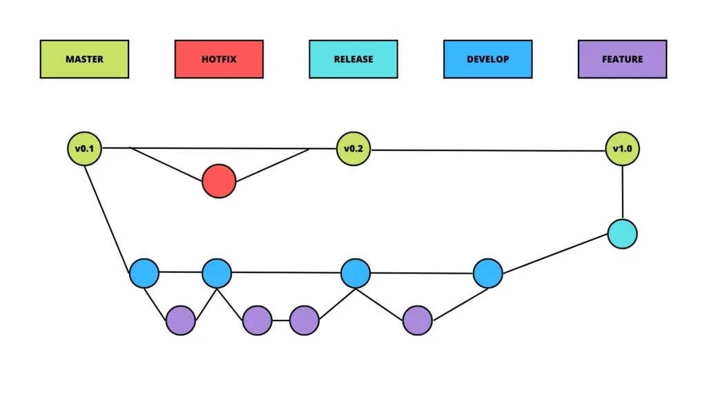

# Documentation GitFlow de base

## Introduction
GitFlow est une stratégie de gestion de branches dans Git. Elle permet de mieux organiser les workflows de développement, en séparant le travail en plusieurs types de branches.

## Branches principales

### 1. `main`
- Contient le code en production.
- Doit toujours être stable.
- Les versions finales du projet y sont fusionnées.

### 2. `develop`
- Contient la dernière version de développement du projet.
- Reçoit les fonctionnalités terminées et testées.

## Branches de support

### 3. `feature/*`
- Branche utilisée pour développer une nouvelle fonctionnalité.
- Créée à partir de `develop` et fusionnée dans `develop` une fois terminée.
  
  ```bash
  git checkout develop
  git checkout -b feature/nom-fonctionnalité


  # Une fois la fonctionnalité terminée
  git checkout develop
  git merge feature/nom-fonctionnalité
  ```

### 4. `release/*`
- Branche de préparation pour une nouvelle version de production.
- Créée à partir de `develop` et fusionnée dans `main` et `develop`.
- Permet les derniers ajustements et corrections de bugs avant la mise en production.

  ```bash
  git checkout develop
  git checkout -b release/v1.0.0

  # Une fois la release prête
  git checkout main
  git merge release/v1.0.0
  git checkout develop
  git merge release/v1.0.0
  ```

### 5. `hotfix/*`
- Branche pour corriger rapidement un bug critique en production.
- Créée à partir de `main` et fusionnée dans `main` et `develop`.

  ```bash
  git checkout main
  git checkout -b hotfix/bug-critique

  # Une fois le hotfix terminé
  git checkout main
  git merge hotfix/bug-critique
  git checkout develop
  git merge hotfix/bug-critique
  ```


## Conclusion

GitFlow offre une structure claire pour gérer les différentes étapes du développement logiciel, de la création de nouvelles fonctionnalités à la gestion des versions et des corrections urgentes. En suivant ce workflow, les équipes peuvent travailler de manière plus organisée et efficace.

